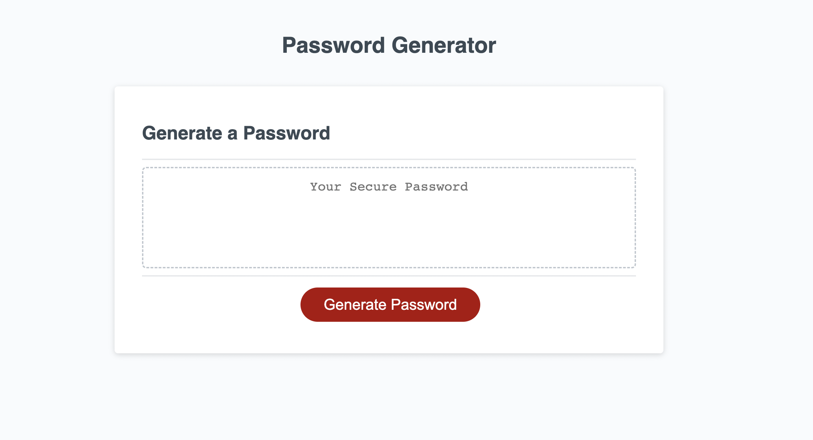

# Random Password Generator
## Refactoring Password Generator code

1. This project was created to practice Web APIs in Javascript and further learn how to make webpages more user friendly.
2. It aids in understanding functions and event listeners. As well as making the webpage more user-firendly and accesible
3. This project allowed me to truly comprehend the topics taught during lessons

## Installation

+ GitHub repository and deployed weboage links are easily accesed via the following links:
    + https://github.com/priyanka-agrawal025
    + https://priyanka-agrawal025.github.io/random-password-generator/

## Usage

+ Instructions:
    + Click the "generate password" button to begin the process of creating a randomized password
    + Answer all prompts to generate the password
    + Password should appear in text box once all prompts have been answered

## License

MIT License, available on GitHub repository
